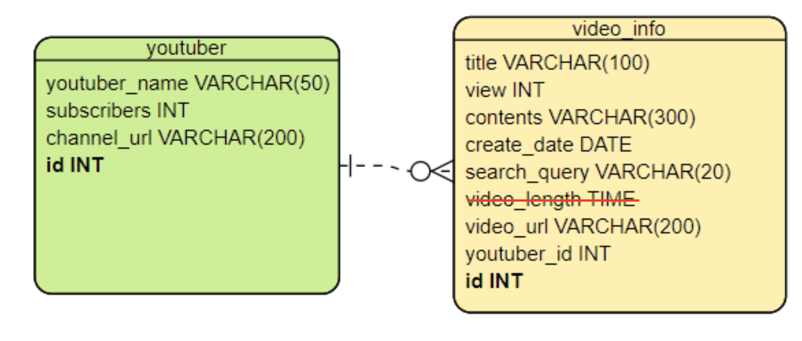

# A. 기획

## (1) 수집할 데이터 정하기

youtube

## (2) 어떤 분석을 할지 정하기

### 주제 : 유투브에서 삼성과 애플 리뷰 영상 정보 스크래핑을 통한 인기도 분석

(애플, 삼성의 핸드폰으로만 한정한다. )

### 분석 내용

- 검색어
    - 갤럭시, 갤럭시z플립 4, 갤럭시폴드4
    - 아이폰, 아이폰14, iphone 14, iphone 14 pro

- 분석 주제

1) 정해진 기간 내에 많이 올라간 영상 주제
2) 애플 vs. 삼성 조회수가 어떻게 되는지 (누가 더 많은지?)
3) 얼마나 많은 유튜버들이 컨텐츠를 만들었는지?
4) 한 명의 유투버가 제품마다 몇 개의 영상을 올렸는지?

## (3) 역할 분담 & 간략 일정 계획

- 일정 계획

    - 2022/8/16 
        - 스크래핑하기

    - 2022/8/17, 18 
        - create table & insert
        - 분석

## (4) 산출물
- [scraping.ipynb](https://github.com/slow-wave/bootcamp/blob/main/scraping.ipynb)
    - scraping하는 코드 → csv, dataframe (pandas)
- [db_insert.ipynb](https://github.com/slow-wave/bootcamp_scraping-project/blob/main/db_insert.ipynb)
    - (pymysql) DB create & insert하는 코드
- [analysis.sql](https://github.com/slow-wave/bootcamp_scraping-project/blob/main/analysis.sql)
    - 분석하는 sql query
- [final]youtuber_df.csv
    - youtuber table에 insert할 data
- [final]video_info_df.csv
    - video_info table에 insert할 data

# B. 데이터 저장

## (1) 수집할 column 정의하기

video_info table
- video id : video id
- title : 유튜브 영상의 제목 
- view : 조회수
- contents : 유튜브 영상의 소개글
- create_date : date
- search_query : 검색어
- video_url : 영상의 url
- youtuber id : youtuber id

youtuber table
- youtuber id : youtuber id
- youtuber_name : youtuber 이름
- channel_url : 채널의 url

## (2) 테이블 설계하기

- ERD tool : [https://online.visual-paradigm.com/app/diagrams/#diagram:proj=0&type=ERDiagram&width=11&height=8.5&unit=inch](https://online.visual-paradigm.com/app/diagrams/#diagram:proj=0&type=ERDiagram&width=11&height=8.5&unit=inch)
- ERD 예시 : [https://gitmind.com/kr/erd-examples.html](https://gitmind.com/kr/erd-examples.html)

- 최종 ERD

# C. 데이터 스크래핑 & insert

(1) 스크래핑 할 범위 지정하기

(2) 스크래핑 코드 작성

(3) dataframe to table(mysql)

- dataframe insert 하는 방법 [http://dbcafe.co.kr/wiki/index.php/Pandas_mysql_insert](http://dbcafe.co.kr/wiki/index.php/Pandas_mysql_insert)
- [https://www.fun-coding.org/mysql_advanced2.html](https://www.fun-coding.org/mysql_advanced2.html)

# D. 데이터 분석

(1) SQL 활용해서 분석하기
